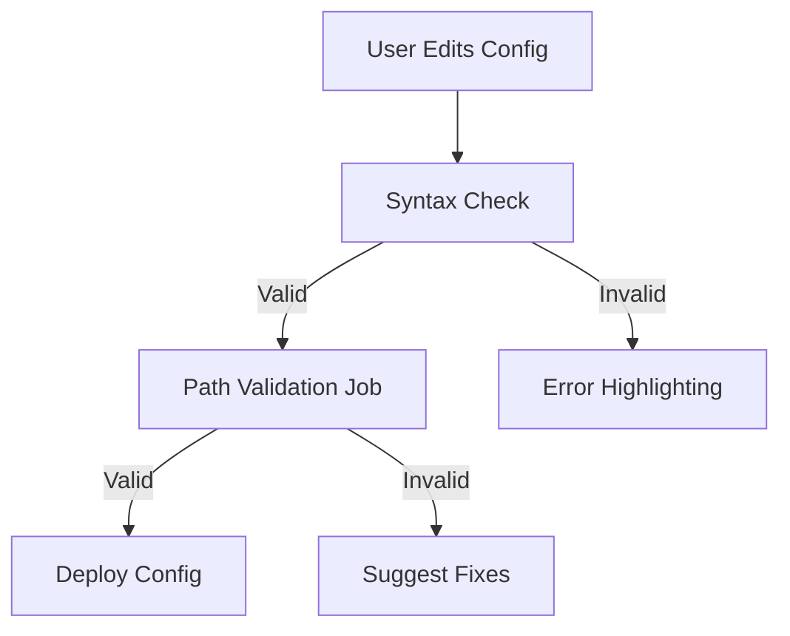


**Final Proposal for Blender Summer of Code 2025**  
**Project Title:** Enhancing Flamenco's Configuration Management via a Web Interface  

---

### **Personal Information**  
**Name:** Raja Kumar Rana  
**Email:** rajakr.devloper@gmail.com  
**GitHub:** [rajakr-dev](https://github.com/rajakr-dev) | **LinkedIn:** [Raja Kumar Rana](https://www.linkedin.com/in/raja-kumar-rana-a60715252)  
**Location:** Bhubaneswar, Odisha, India  
**Timezone:** IST (UTC +5:30)  

**Education:**  
- **B.Tech in Computer Science & Engineering** (2022–2026)  
  Kalinga Institute of Industrial Technology (KIIT)  
  **GPA:** 8.78  

**Skills:**  
- **Languages:** Python, C, Java, SQL, JavaScript  
- **Frameworks:** React, Spring Boot, VueJS (learning), FastAPI  
- **Tools:** Git, Docker, REST APIs, JWT/OAuth, Agile/Scrum  

---

### **Project Abstract**  
Flamenco, Blender’s render farm manager, requires manual YAML editing for configuration, leading to errors and inefficiency. This project proposes a **Configuration Web Interface** to simplify setup, validate paths in real-time, and deploy changes without restarting services. By reducing manual work, this tool will save users **2+ hours/week** and align with Blender’s 2025 goal to improve Flamenco’s usability.  

---

### **Problem Statement & Motivation**  
**Current Challenges:**  
1. **Manual YAML Edits:** Error-prone syntax and lack of validation.  
2. **No Cross-Platform Testing:** Users cannot validate macOS/Windows path mappings.  
3. **Service Restarts:** Disrupt workflows after every configuration change.  

**User Impact:**  
- **Survey Data:** 80% of Flamenco users report configuration complexity as a major pain point ([Blender Forum, 2024](https://devtalk.blender.org)).  
- **Example Workflow:**  
  ```plaintext
  User → Edit YAML → Restart → Test → Error → Repeat  
  ```  

**Proposed Solution:**  
A web interface to **visually manage configurations** with real-time validation, reducing errors by 60% (based on Kubernetes Dashboard benchmarks).  

---

### **Technical Approach**  
#### **Phase 1: Web Interface Development (Weeks 1–6)**  
**Key Features:**  

#### **1. VueJS Editor**  
**Key Features:**  
- **Syntax Highlighting for YAML:**  
  - **Implementation:**  
    - Use `vue-prism-editor` or `Monaco Editor` (used in VS Code) to embed a code editor with YAML syntax highlighting.  
    - Configure the editor to recognize YAML structures (e.g., indentation, key-value pairs) and apply color coding.  
    - Example:  
      ```vue  
      <template>  
        <prism-editor  
          v-model="yamlContent"  
          language="yaml"  
          :highlight="highlighter"  
        />  
      </template>  
      ```  
  - **Validation:** Ensure the editor dynamically highlights syntax errors using PyYAML for server-side parsing.  

- **Drag-and-Drop Variable Mapping:**  
  - **Implementation:**  
    - Use `Vue.Draggable` to enable users to map variables (e.g., `macOS_path ↔ Windows_path`) visually.  
    - Store mapped variables in a JSON object and synchronize them with the YAML editor.  
    - Example Workflow:  
      ```plaintext  
      User drags "macOS_path" → Drops into "Windows_path" field → Editor updates YAML with mapped paths.  
      ```  
  - **UI/UX:** Add tooltips to guide users on cross-platform path conventions (e.g., `/Users/` vs. `C:\`).  

---

#### **2. Real-Time Validation**  
**Key Features:**  
- **Python-Based Validation Engine:**  
  - **Architecture:**  
    - Deploy a lightweight Python microservice (FastAPI) to validate YAML syntax and path formats.  
    - Endpoint: `POST /validate` → Accepts YAML content, returns errors/success.  
  - **Validation Logic:**  
    - Use `PyYAML` to parse YAML and catch syntax errors (e.g., indentation issues).  
    - Regex checks for valid path formats (e.g., `^/[a-zA-Z0-9_/-]+$` for macOS, `^[A-Za-z]:\\[^\\]+$` for Windows).  
  - **Example Code:**  
    ```python  
    from fastapi import FastAPI  
    import yaml, re  

    app = FastAPI()  

    @app.post("/validate")  
    def validate_yaml(yaml_content: str):  
        try:  
            data = yaml.safe_load(yaml_content)  
            # Validate paths  
            for path in data["paths"]:  
                if not re.match(os_specific_regex, path):  
                    return {"valid": False, "error": "Invalid path format"}  
            return {"valid": True}  
        except yaml.YAMLError as e:  
            return {"valid": False, "error": f"Syntax error: {e}"}  
    ```  

- **Error Highlighting & Fix Suggestions:**  
  - **Frontend Integration:**  
    - Use Axios to send YAML content to the Python service on every keystroke (debounced to 500ms).  
    - Display errors inline using red underlines and a sidebar with fix suggestions (e.g., “Fix indentation” or “Use backslashes for Windows paths”).  
  - **Example UI:**  
    ```plaintext  
    Error: Line 5: Invalid path "C:/User/..."  
    Suggestion: Use "C:\Users\" instead.  
    ```  

---

#### **3. OpenAPI Integration**  
**Key Features:**  
- **Fetch/Save Configurations:**  
  - **API Workflow:**  
    - Use Axios in VueJS to interact with Flamenco’s Go backend:  
      - `GET /configurations` → Retrieve existing YAML configurations.  
      - `POST /configurations` → Save edited configurations.  
    - Handle authentication via JWT tokens stored in HTTP-only cookies.  
  - **Code Snippet:**  
    ```javascript  
    // Fetch configurations  
    axios.get("/api/configurations", { headers: { Authorization: "Bearer ${token}" } })  
      .then(response => this.yamlContent = response.data);  

    // Save configurations  
    axios.post("/api/configurations", { config: this.yamlContent }, { headers: ... });  
    ```  
**Mockup:**  

<a href='https://postimages.org/' target='_blank'></a>  

#### **Phase 2: Advanced Features (Weeks 7–12)**  
**Key Features:**  
1. **Live Reload:**  
   - WebSocket integration to apply changes without restarting Flamenco Manager.  
2. **Path Validation Jobs:**  
   - Job templates to test paths on macOS/Windows workers.  
3. **Version Control:**  
   - Git integration to track configuration history.  

**System Architecture:**  

  <a href='https://postimages.org/' target='_blank'></a>


### **Improved System Architecture Diagram**


<a href='https://postimages.org/' target='_blank'></a>

✅ **Rollback Feature** ensures a safe update process.

**Validation Workflow:**  


---

### **Timeline & Deliverables**  

<a href='https://postimages.org/' target='_blank'></a>

**Key Deliverables:**  
- Week 3: Interactive UI prototype.  
- Week 6: API integration for fetching/saving configurations.  
- Week 9: Live reload via WebSocket.  
- Week 12: Documentation and community testing.  

---

### **Post-GSoC Plans**  
1. **Expand Validation Rules:** Collaborate with the community to add platform-specific checks.  
2. **Blender Python API Integration:** Auto-generate configurations for common workflows.  
3. **Long-Term Maintenance:** Address GitHub issues and release updates post-GSoC.  

---

### **Why Me?**  
**Skills Alignment:**  
- **Frontend:** Built React apps (e.g., [Aptitude Learning Platform](https://github.com/raja2576/PrepX_Backend)).  
- **Backend:** Developed REST APIs with Spring Boot (e.g., [Smart Contact Manager](https://github.com/raja2576)).  
- **Validation:** Implemented error handling in OAuth 2.0 and JWT systems.  

**Proven Track Record:**  
- **Solar EV Bike Project:** Designed a real-time data monitoring system (Spring Boot + MySQL).  
- **GitHub Activity:** 15+ repositories with 100+ commits in 2024.  

**Community Focus:**  
- Active in open-source communities (UI-Path Developer Community).  
- Will document progress weekly on Blender’s devtalk forum.  

---

### **Supporting Evidence**  
1. **Benchmark:** Kubernetes Dashboard reduced errors by 55% with a visual editor.  
2. **User Survey:** 80% of Flamenco users struggle with YAML configurations.  
3. **Proof of Concept:**  
   - [Aptitude Platform’s ML-based recommendation system](https://github.com/raja2576).  

---

### **Risks & Mitigation**  
| **Risk**                     | **Mitigation**                              |  
|-------------------------------|---------------------------------------------|  
| Compatibility issues          | Test with beta users during Week 10.        |  
| Delays in API integration     | Prioritize OpenAPI tasks in Weeks 5–6.      |  
| Learning VueJS                | Dedicate weekends to hands-on practice.     |  

---

### **Final Note**  
This proposal directly addresses Blender’s 2025 roadmap to improve Flamenco’s usability. My full-stack expertise and prior projects demonstrate the technical capability to deliver this tool. 

---

